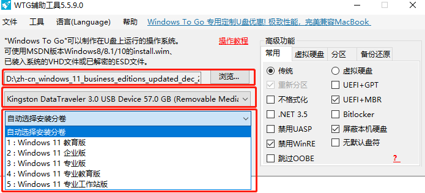

# 使用教程
### 一.将此项目下载到本地
可以直接下载也可以git clone

# 二.使用vs打开项目
要本地电脑上安装vs,并打开wintogo.sln

# 三.编译整个解决方案
会出来一些警告，不要理这些

# 四.将files.dat复制到bin目录
files.dat 其实就是一些磁盘操作工具，是一个压缩包，你可以将files.dat修改成files.zip 解压出来看看只面使用到的工具

# 五.运行 wintogo.exe
wintogo.exe 文件是编译好的程序
在bin下直接运行也可以直接在vs里运行调试

# 六.使用

从上到下三步即可完成随身系统的制作：
- 1.选择系统镜像
可以到我的百度云盘下载纯净原版的iso

- 2.选择需要安装的U盘或移动硬盘设备
一定要做好备份，因为这个操作会将你的移动设备里的数据全局格式化

- 3.选择系统镜像里的分卷
建议选择企业版，不过配置时需要使用企业账号，不过可以使用域的方式配置

# 七.移动u盘建议
爱国者 aigo U330
CHIPFANCIER 
或者使用ssd外接

